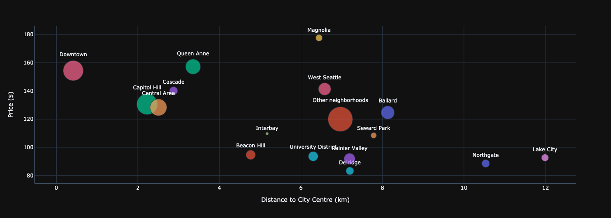

# Airbnb Seattle Analysis Blog Post
### Udacity DataScience NanoDegree Project 1

This repo contains the code used to produce the data analysis and visualistion in this (https://medium.com/p/438db3d27c4f/edit) Medium article.

It can be seen that the neighbourhood stayed in affects the price.

Distance to city centre affects price.

## Business Understanding

The purpose of this analysis was to explore how the airbnb prices are affected across neighbourhoods. it also looks at how the properties are being managed by the hosts and can be seen that particular neighbourhoods are container owners that have multiple properties available all year round to make a profit. 

## Data Understanding

Data Source: http://insideairbnb.com/get-the-data.html

The data made available was:
Calendar.csv - Seattle Airbnb prices across the year
Lisitngs.csv - the listings available in Seattle in 2016
Neighbourhoods.gejson -  geojson for neighbourhood zones

## Modelling and Preparation

Data cleaning was performed, including:

- Cleaning strings of unwanted characters
- Datasets where joined

## Modelling

A machine learning algorithm was developed to try and predict house prieces and therefore allow 
the user to find good property prices.

## Evaluation

RMS was etc.

## Deployment
- Tools
    - Jupyter Notebooks
    - Plotly (https://towardsdatascience.com/how-to-create-a-plotly-visualization-and-embed-it-on-websites-517c1a78568b)
    - Scikit learn

# Acknowledgement
 This was completed as Project 1 of Udacity's Datascience Nanodegree
